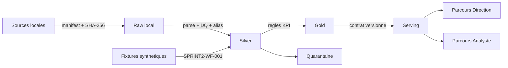

# Architecture cible et contrats Sprint 2

## Decision technique proposee

Le produit separe quatre couches : Raw local immuable, Silver type et anonymise, Gold metier, puis Serving en lecture. La maquette consomme un contrat Serving synthetique et ne lit jamais les fichiers bruts.

## Invariants

1. Meme entree + meme configuration = memes octets de sortie.
2. Aucune ligne invalide ne disparait silencieusement ; elle est acceptee, avertie ou quarantinee.
3. Chaque valeur Serving possede `run_id`, `source_id`, `business_date`, `freshness_status`, `quality_status` et `lineage_ref`.
4. Les identifiants prives sont interdits au-dela des zones locales restreintes.
5. La couche Gold ne depend ni du framework frontend ni de l'outil BI futur.

## Composants

| Composant | Entree | Sortie | Echec controle |
|---|---|---|---|
| Manifest builder | fichiers locaux ou fixtures | empreintes, tailles, alias de source | fichier absent ou non autorise |
| Parser | CSV synthetiques 38/51 colonnes et JSON de cas | enregistrements Silver | largeur, type, section vide |
| DQ engine | enregistrements Silver | anomalies et quarantaine | regle bloquante |
| KPI engine | Silver valide | Gold KPI | prerequis ou domaine invalide |
| Publisher | Gold + rapport de scan | Serving JSON | denylist, identifiant prive, lot non valide |
| Web prototype | Serving JSON synthetique | vues Direction / Analyste | etats demonstrables |

## Interfaces et droits

- `viewer_direction` : lecture des agregats et des statuts ; aucun detail source.
- `viewer_analyst` : lecture des anomalies, lineage opaque et simulation de resolution.
- `data_steward` : validation et publication simulees dans le prototype ; production future.
- `administrator` : interface seulement, reservee aux sprints ulterieurs.

Les contrats sont versionnes dans `Sprint 2/contracts/`. Le modele de droits de production et l'outil Serving final restent `Pending partner validation`.

## Limites de sprint

La maquette et le pipeline de preuve sont fonctionnels. L'orchestration de production, le stockage gere, le RBAC reel, l'integration d'une source de pairs certifiee et les analytics avances de production ne sont pas declares termines ; ils restent des interfaces pour les Sprints 3 a 5.
