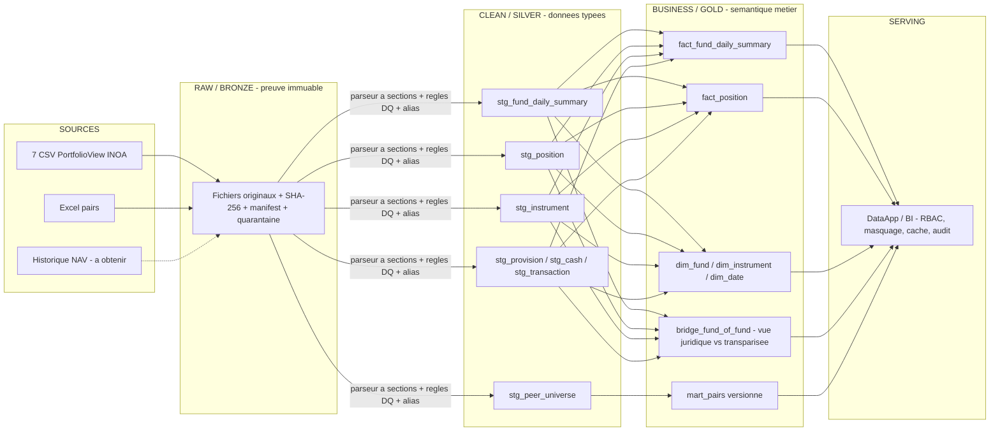

# Audit des données et data-flow — Sprint 2

**Projet :** Inteli × YvY Capital — Pipeline data & DataApp
**Livrable Sprint 2 :** « Data audit and data-flow draft » (lead : Adrien · relecture : Raphael, Viktor)
**Version :** 0.9 · 20/08/2026 · Statut : Draft pour gate W4
**Preuve :** tous les chiffres de ce document sont recalculés programmatiquement depuis les fichiers sources (run SPRINT2-WF-001).

---

## 1. Inventaire et disponibilité des sources

| Source | Contenu | Volume observé | Fraîcheur | Statut |
|---|---|---|---|---|
| 7 exports CSV PortfolioView (INOA) | Position quotidienne consolidée par fonds : résumé, positions, caisse, provisions, opérations, changes | 81 à 132 lignes/fichier · 38 ou 51 colonnes · 663 lignes cumulées | **1 seule date métier : 29/05/2026** | Disponible, semi-structuré |
| Classeur pairs (Excel) | 4 univers de pairs, 5 fonds internes rattachés | 25 + 15 + 15 + 15 lignes | Non daté | Disponible, nettoyage requis |
| Dictionnaire Markdown | 6 tables logiques, grains, 2 règles de gouvernance | — | — | Disponible |
| Historique NAV / positions / flux | Série quotidienne nécessaire aux KPI de risque | **Non livré** | — | **Bloquant Sprint 4 (P0-4)** |
| Canal d'ingestion automatisé | Dépôt INOA / boîte technique | **Non défini** | — | Question P0-1 |

## 2. Constats de qualité — vérifiés dans les données

### 2.1 Structure
- Fichiers **semi-structurés à sections empilées** (23 libellés de section détectés par fichier, 1 à 6 avec données) : un `read_csv` rectangulaire est impossible ; parseur à machine à états requis.
- Largeur variable : 38 colonnes (FUND_02/03/05/07) vs 51 (FUND_01/04/06).
- En-têtes techniques non traduits (`portfolio-front.export-file.*`) dans le résumé et les pieds de fichier.

### 2.2 Cohérence
- **Identité PL = part × nombre de parts** : écarts de −167,79 BRL (FUND_01) à +597,88 BRL (FUND_04) — arrondis probables, tolérance à paramétrer (DQ09).
- **Structures fonds-dans-fonds non déclarées** : 4 liens détectés par rapprochement exact des quantités et valeurs de part. Somme brute 1 084 593 077,84 BRL vs encours économique estimé 555 603 469,48 BRL (**×1,95**). Hypothèse à faire confirmer (P0-5).
- Fenêtres YTD/6m/12m identiques sur 4 fonds : historique incomplet ou fonds récents.

### 2.3 Types et valeurs
- Décimaux brésiliens (`.` milliers, `,` décimales) sur tous les montants ; conversion sans perte exigée (DQ05).
- Champ `Duration` illisible sur 23 positions (points multiples, ex. `59.192.460.317.460`) → conserver `duration_raw`, bloquer la conversion (P1-12).
- `Cota Congelada = true` sur 7/7 fonds — sens métier non confirmé (P1-11).
- **Prix obsolète** : action non cotée de FUND_04 valorisée au 31/03/2026 pour une référence au 29/05/2026 (59 jours) — politique de staleness à définir (P1-10).
- Date métier (29/05) ≠ horodatage des noms de fichiers (22/06) : écart de 24 jours inexpliqué — stocker les deux dates en Bronze.
- Section Provisões **présente mais vide** pour FUND_03 (3 à 12 lignes ailleurs) → règle DQ « section vide vs section absente ».
- Lignes répétées d'un même ISIN avec `Id do Contrato` distincts (FUND_06) : ce ne sont **pas** des doublons — agrégation en vue instrument requise.

### 2.4 Classeur des pairs
| Univers | N | Complétude rentab. | Complétude frais | CNPJ dupliqués | Rentab. extrêmes |
|---|---|---|---|---|---|
| FIAGRO | 25 | 17/25 | 16/25 | 2 | 0 |
| RF Infra Incentivadas | 15 | 15/15 | 14/15 | 0 | 0 |
| Multimercado (partiel) | 15 | 15/15 | 15/15 | 0 | 0 — sous-classe ANBIMA à confirmer |
| FIP Multi | 15 | 15/15 | 4/15 | **5** | **8 valeurs > 100 %** (jusqu'à 43 216 648 %) |

L'univers FIP est inexploitable sans déduplication CNPJ et quarantaine des extrêmes. Les investissements minimums sont stockés en texte.

### 2.5 Confidentialité — vecteur de fuite confirmé
Les colonnes `Instrumento` de 4 exports contiennent le **nom réel d'un fonds interne** ; le Resumo du classeur pairs expose les 5 noms internes réels. Le masquage du nom de fichier ne suffit pas : **le masquage doit s'appliquer au niveau des valeurs** (instruments, émetteurs, dépositaires) dans toute sortie partageable, avec un scan automatique des noms interdits en gate CI/CD.

## 3. Proposition de masquage

| Donnée | Traitement | Zone |
|---|---|---|
| Identifiant de fonds | Alias `FUND_01`–`FUND_07` ; table d'alias en zone restreinte, jamais dans un dépôt partagé | Silver et au-delà |
| Positions en fonds internes | `FUND_XX (parts)` | Silver |
| Instruments privés (débentures, CPR, actions non cotées, parts de fonds tiers) | Libellé générique conservant indexeur/taux/échéance + `INSTR_{id}` ; ISIN conservé | Sorties partageables |
| Instruments publics (titres d'État, futures listés) | Libellé générique conservé | — |
| Émetteurs privés / dépositaires | `EMET_xx` / `CUSTO_xx` | Sorties partageables |
| Souscriptions / rachats (porteurs) | Anonymisation LGPD avant toute ingestion | Dès Bronze |

## 4. Data-flow proposé (draft)

**Responsabilités par couche** — Bronze : écriture unique par l'ingestion, immuable, rétention longue. Silver : parseur + normalisation + alias + quarantaine (aucune ligne invalide ne disparaît silencieusement). Gold : règles métier validées, éliminations intra-groupe, KPI ; versionné. Serving : lecture seule, RBAC par fonds, scan de noms interdits avant publication. **La couche Gold reste indépendante de l'outil de restitution.**

## 5. Règles DQ prioritaires (à implémenter Sprint 3)

| ID | Règle | Sévérité | Traitement |
|---|---|---|---|
| DQ01 | Unicité fonds × date | Bloquant | Quarantaine |
| DQ02 | `contract_id` unique par fonds/date/section | Bloquant | Rejet de section |
| DQ04 | Date métier présente et ouvrée | Bloquant | Quarantaine |
| DQ05 | Conversion décimale BR sans perte | Bloquant | Rejet de champ |
| DQ06 | Nb de colonnes = en-tête de section | Bloquant | Quarantaine |
| DQ07 | NAV > 0 | Bloquant | Quarantaine |
| DQ09 | Identité PL vs part×parts sous tolérance | Majeur | Alerte |
| DQ11 | Positions + caisse + provisions ≈ PL | Bloquant | Quarantaine |
| DQ15 | Staleness prix sous seuil par classe | Majeur | Alerte |
| DQ20 | Zéro nom interdit dans les sorties | Bloquant | Blocage publication |
| DQ22 | CNPJ pair unique par univers/version | Majeur | Fusion contrôlée |
| DQ23 | Section vide vs absente distinguées | Avertissement | Journal |

## 6. Demandes au partenaire (bloquantes pour la suite)

1. **P0-1** Canal de dépôt automatisé des exports INOA.
2. **P0-4** Historique quotidien NAV/positions/provisions/flux — conditionne tout le Sprint 4 analytique.
3. **P0-5** Registre des fonds : quels fonds investissent dans d'autres fonds internes (valide le bridge).
4. **P0-6** Matrice d'accès : qui voit quel fonds, qui valide une anomalie.
5. **P1-8/9** Source officielle des pairs, approbation et versionnage des groupes ; benchmark et taux sans risque par fonds.
6. **P1-10/11/12** Tolérances de rapprochement et staleness ; sens de `Cota Congelada` ; unité du champ `Duration`.
