# Sprint 3 Entity Relationship Diagram

The authoritative schema is [`Sprint 2/database/sprint3_schema.sql`](../../Sprint%202/database/sprint3_schema.sql). This ERD uses the same 22 table names, primary keys, foreign keys, and cardinalities. Restricted columns are stored only in the local database and are intentionally omitted from most diagram entities for readability; omitting a non-key attribute does not remove it from the SQL schema.

The editable Mermaid source is available in [`sprint3_erd.mmd`](sprint3_erd.mmd).

```mermaid
erDiagram
    ingestion_runs ||--o{ source_files : records
    ingestion_runs ||--o{ pipeline_stage_counts : summarizes
    ingestion_runs ||--o{ quality_issues : detects
    ingestion_runs ||--o{ quarantine_records : quarantines
    ingestion_runs ||--o{ funds : loads
    ingestion_runs ||--o{ fund_nav_snapshots : loads
    ingestion_runs ||--o{ portfolio_holdings : loads
    ingestion_runs ||--o{ return_series : loads
    ingestion_runs ||--o{ transaction_summaries : loads
    ingestion_runs ||--o{ cash_flows : loads
    ingestion_runs ||--o{ corporate_payments : loads
    ingestion_runs ||--o{ drawdowns : loads
    ingestion_runs ||--o{ liquidity_horizons : loads
    ingestion_runs ||--o{ stress_results : loads
    ingestion_runs ||--o{ dv01_results : loads
    ingestion_runs ||--o{ dv01_items : loads
    ingestion_runs ||--o{ bond_instruments : loads
    ingestion_runs ||--o{ var_mask_configs : loads
    ingestion_runs ||--o{ gold_allocations : loads
    ingestion_runs ||--o{ gold_fund_latest : loads
    ingestion_runs ||--o{ lineage_records : proves

    funds ||--o{ fund_nav_snapshots : has
    funds ||--o{ portfolio_holdings : has
    funds ||--o{ return_series : has
    funds ||--o{ transaction_summaries : has
    funds ||--o{ cash_flows : has
    funds ||--o{ corporate_payments : has
    funds ||--o{ drawdowns : has
    funds ||--o{ liquidity_horizons : has
    funds ||--o{ stress_results : has
    funds ||--o{ dv01_results : has
    funds ||--o{ bond_instruments : has
    funds ||--o{ gold_allocations : summarizes
    funds ||--o| gold_fund_latest : projects
    fund_nav_snapshots ||--o{ portfolio_holdings : reconciles
    fund_nav_snapshots ||--o{ gold_allocations : aggregates
    fund_nav_snapshots ||--o| gold_fund_latest : projects
    dv01_results ||--o{ dv01_items : contains

    ingestion_runs {
        varchar run_id PK
        char bundle_sha256 UK
        varchar transform_version UK
        varchar status
        datetime completed_at
    }
    source_files {
        varchar run_id PK,FK
        varchar logical_name PK
        char sha256
        int row_count
    }
    pipeline_stage_counts {
        varchar run_id PK,FK
        varchar stage_name PK
        int accepted_records
    }
    quality_issues {
        char issue_id PK
        varchar run_id FK
        char record_ref_hash
        varchar rule_id
        varchar severity
    }
    quarantine_records {
        char quarantine_id PK
        varchar run_id FK
        char record_ref_hash
    }
    funds {
        varchar source_fund_id PK
        varchar fund_code UK
        varchar last_run_id FK
    }
    fund_nav_snapshots {
        varchar source_fund_id PK,FK
        date snapshot_date PK
        decimal nav_brl
        varchar last_run_id FK
    }
    portfolio_holdings {
        varchar source_fund_id PK,FK
        date snapshot_date PK
        varchar group_identifier PK
        varchar item_id PK
        varchar holding_code UK
        varchar last_run_id FK
    }
    return_series {
        varchar source_fund_id PK,FK
        varchar series_type PK
        date business_date PK
        decimal index_value
        varchar last_run_id FK
    }
    transaction_summaries {
        varchar source_fund_id PK,FK
        date start_date PK
        date end_date PK
        varchar last_run_id FK
    }
    cash_flows {
        varchar source_fund_id PK,FK
        date business_date PK
        varchar last_run_id FK
    }
    corporate_payments {
        char event_key PK
        varchar source_fund_id FK
        date ex_date
        varchar last_run_id FK
    }
    drawdowns {
        varchar source_fund_id PK,FK
        date business_date PK
        varchar last_run_id FK
    }
    liquidity_horizons {
        varchar source_fund_id PK,FK
        date as_of_date PK
        int projection_days PK
        varchar last_run_id FK
    }
    stress_results {
        varchar source_fund_id PK,FK
        date business_date PK
        varchar last_run_id FK
    }
    dv01_results {
        varchar source_fund_id PK,FK
        date business_date PK
        varchar last_run_id FK
    }
    dv01_items {
        char item_key PK
        varchar source_fund_id FK
        date business_date FK
        varchar last_run_id FK
    }
    bond_instruments {
        varchar source_fund_id PK,FK
        varchar instrument_id_restricted PK
        varchar last_run_id FK
    }
    var_mask_configs {
        varchar var_mask_id_restricted PK
        varchar mask_code UK
        varchar last_run_id FK
    }
    gold_allocations {
        varchar source_fund_id PK,FK
        date snapshot_date PK
        varchar group_identifier PK
        varchar last_run_id FK
    }
    gold_fund_latest {
        varchar source_fund_id PK,FK
        varchar last_run_id FK
    }
    lineage_records {
        char lineage_id PK
        varchar run_id FK
        char source_sha256
        char target_key_hash
    }
```

## Model notes

- `ingestion_runs` is the governance root for every loaded or rejected bundle.
- `source_files`, `pipeline_stage_counts`, `quality_issues`, `quarantine_records`, and `lineage_records` provide traceability without storing rejected source values.
- `funds.source_fund_id` remains local and restricted; `fund_code` is the safe identifier returned by the API.
- Every fund domain table references `funds`; every loaded row also references the ingestion run that produced it.
- `dv01_items` normalizes nested items from `dv01.csv` and references its `(source_fund_id, business_date)` parent in `dv01_results`.
- `gold_allocations` and `gold_fund_latest` are materialized curated projections used by the Serving layer.
- Holdings and Gold projections reference the exact `(source_fund_id, snapshot_date)` NAV key. The pipeline additionally enforces value reconciliation before loading.
